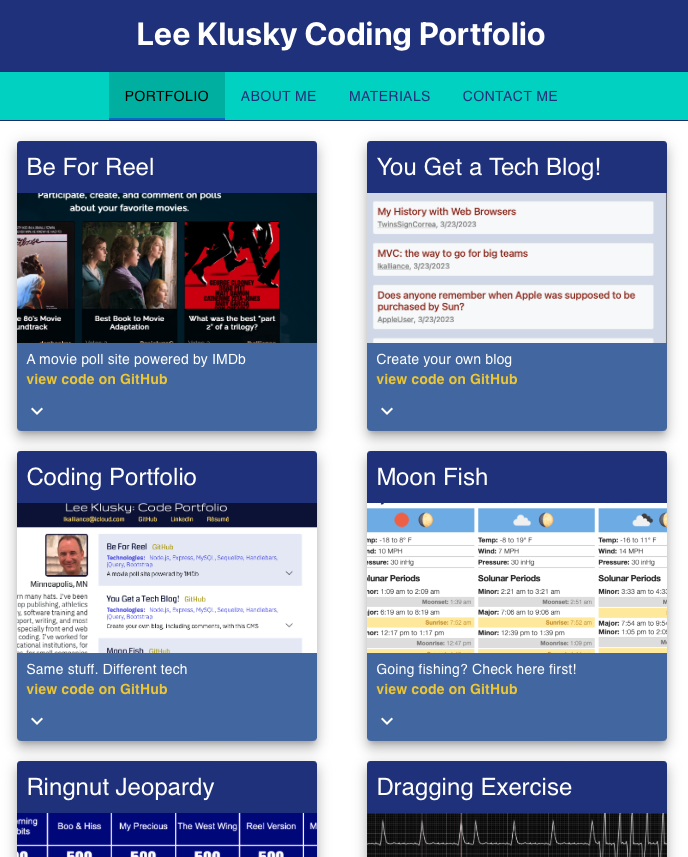

# Lee Klusky Code Portfolio 

## Description

This is a useful web page for potential employers to see me and to get a feel for my skills and my personality. I wanted to provide some text in my own words, some samples of my work, and all the information and links they'll need to reach out to me. I hope this page will inspire them to do that. You can view the code portfolio [here](https://lkalliance.github.io/code-portfolio/#/about).

The preceding paragraph is from the README on my [original code portfolio](https://lkalliance.github.io/module-2-challenge/), published mere months ago. The sentiment is still valid, but my technological tools have certainly gotten more advanced.

There is actually yet another version of this portfolio, using still different technologies, [here](https://lee-k-coding-portfolio.herokuapp.com)

## Table of Contents

- [Installation Instructions](#installation-instructions)
- [Usage Information](#usage-information)
- [Credits](#credits)
- [Software License](#software-license)
- [Contact the Developer](#contact-the-developer)

## Installation Instructions

There is no installation required: this application is hosted on the Web. The user will need a web browser, and will need to have Javascript turned on.

## Usage Information

The user can navigate the portfolio using the main navigation links just below the headline. On the "Portfolio" tab, each coding sample is clickable to go to the hosted application. The user can also click the "view code on GitHub" as well, or can use the disclosure link at the bottom to reveal more information on the given application.

The user can browse my career materials on the "Materials" tab: buttons on that panel will lead the user to a resume, and my GitHub and LinkedIn profiles.

Finally, the user can reach out to me on the "Contact Me" form. All fields are required, and the email address needs to take a proper form.

## Credits

Though I coded this application, it would not have been possible without the help and guidance of instructors and classmates of the [University of Minnesota Full Stack Coding Bootcamp](https://bootcamp.umn.edu/coding/). I also received excellent tips from the [Material UI team](https://mui.com), and the usual help from Internet bloggers and commenters at places like [Stack Overflow](https://www.stackoverflow.com), the [Mozilla Developer Network](https://developer.mozilla.org) and [W3Schools](https://w3schools.com).

## Software License

©2023, Lee Klusky

This software is covered by a [MIT License](https://opensource.org/licenses/MIT).

Permission is hereby granted, free of charge, to any person obtaining a copy of this software and associated documentation files (the "Software"), to deal in the Software without restriction, including without limitation the rights to use, copy, modify, merge, publish, distribute, sublicense, and/or sell copies of the Software, and to permit persons to whom the Software is furnished to do so, subject to the following conditions:

The above copyright notice and this permission notice shall be included in all copies or substantial portions of the Software.

THE SOFTWARE IS PROVIDED "AS IS", WITHOUT WARRANTY OF ANY KIND, EXPRESS OR IMPLIED, INCLUDING BUT NOT LIMITED TO THE WARRANTIES OF MERCHANTABILITY, FITNESS FOR A PARTICULAR PURPOSE AND NONINFRINGEMENT. IN NO EVENT SHALL THE AUTHORS OR COPYRIGHT HOLDERS BE LIABLE FOR ANY CLAIM, DAMAGES OR OTHER LIABILITY, WHETHER IN AN ACTION OF CONTRACT, TORT OR OTHERWISE, ARISING FROM, OUT OF OR IN CONNECTION WITH THE SOFTWARE OR THE USE OR OTHER DEALINGS IN THE SOFTWARE.

## Questions?

Contact me at <a href="mailto:lkbootcamp@yahoo.com">lkbootcamp@yahoo.com</a>, or visit my [GitHub profile](https://www.github.com/lkalliance).
